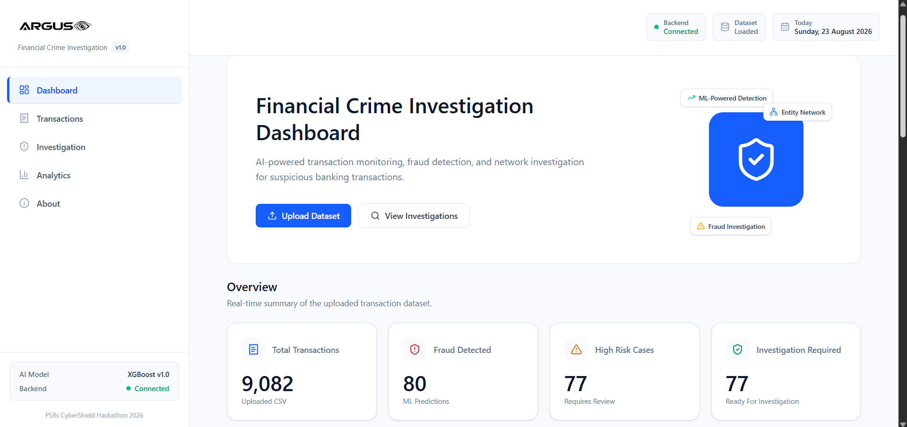
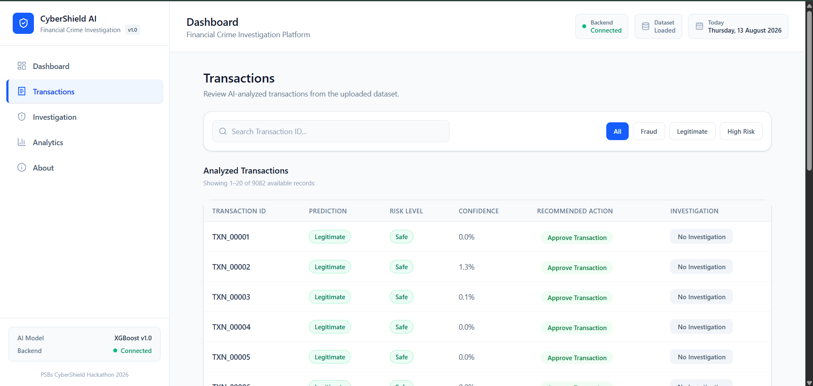
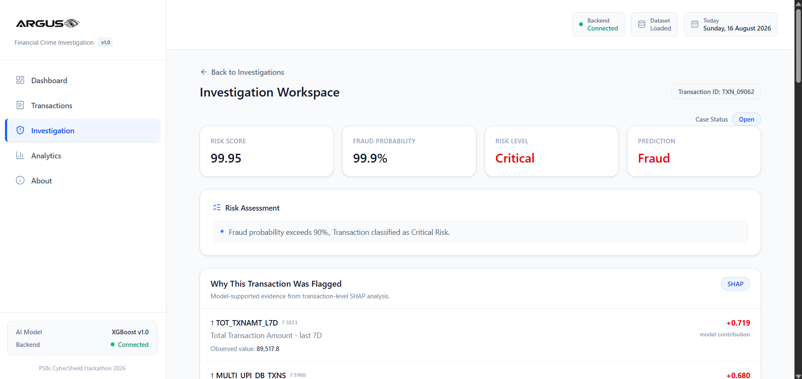
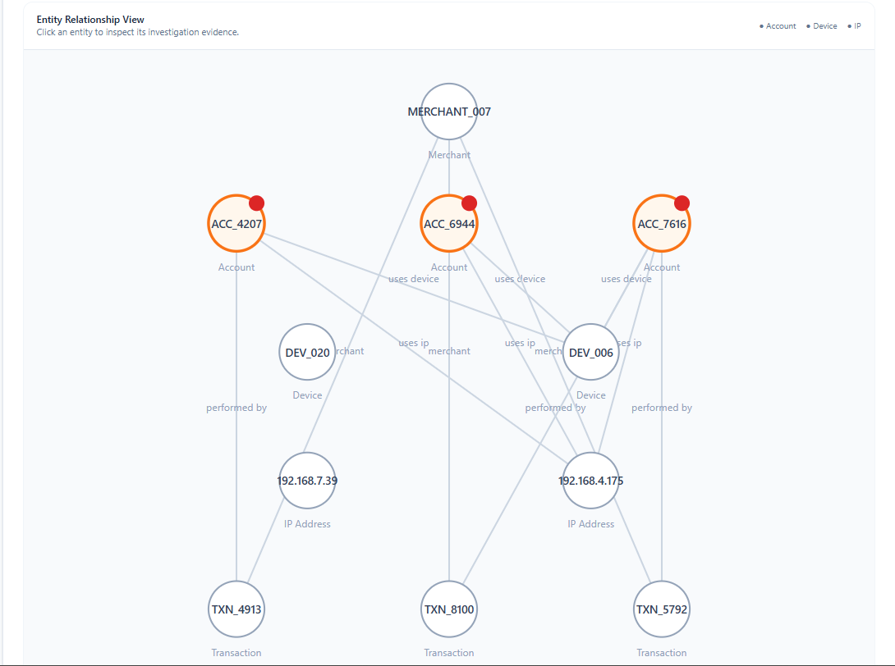
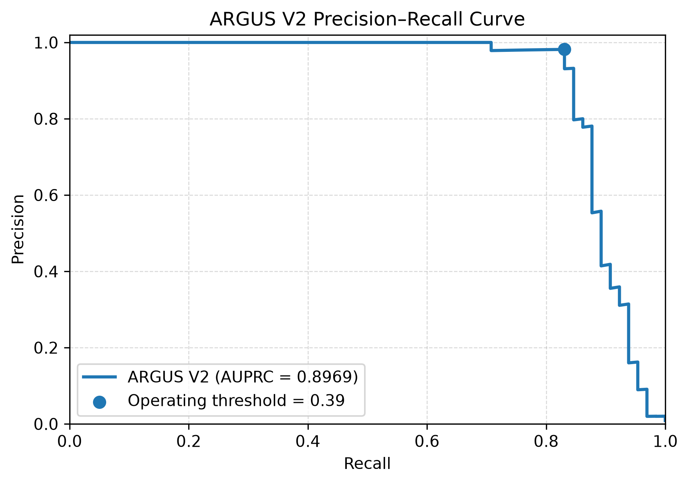

# ARGUS 🛡️

## AI-Powered Financial Threat Detection, Risk Intelligence & Investigation Platform

> **PSBs CyberShield Hackathon Series 2026 — Problem Statement 2: Suspicious Transaction & Mule Account Detection**

**ARGUS** is an AI-powered financial threat detection and investigation platform designed to move beyond simple suspicious-transaction prediction.

It combines **XGBoost-based machine learning, leakage-aware preprocessing, class-imbalance handling, threshold optimization, risk scoring, SHAP explainability, behavioral intelligence, feature-level evidence, and investigation support** into a single workflow:

> **Detect → Assess → Explain → Investigate → Act**

The objective is not only to identify suspicious activity, but to help an investigator understand **why** a case was flagged, **how risky** it is, **which cases deserve priority**, and **what action should be considered next**.

---

## 🎯 Problem

A suspicious alert is only the beginning of a financial investigation.

A detection model may answer:

> “This transaction looks suspicious.”

But an investigator still needs to answer:

- Why was it flagged?
- How risky is it?
- Which cases should be reviewed first?
- What evidence supports the alert?
- What should happen next?

ARGUS is designed to bridge this gap between **model detection** and **investigation decision support**.

---

# 💡 ARGUS Solution

ARGUS connects five stages into one investigation-oriented pipeline.

```text
┌──────────────┐
│    DETECT    │
│ XGBoost ML   │
└──────┬───────┘
       │
       ▼
┌──────────────┐
│    ASSESS    │
│ Risk Engine  │
└──────┬───────┘
       │
       ▼
┌──────────────┐
│   EXPLAIN    │
│    SHAP      │
└──────┬───────┘
       │
       ▼
┌──────────────┐
│ INVESTIGATE  │
│ Behavioral + │
│ Evidence     │
└──────┬───────┘
       │
       ▼
┌──────────────┐
│     ACT      │
│ Recommendation│
└──────────────┘
```

### Core Value Proposition

> **ARGUS transforms isolated suspicious transactions into prioritized, explainable, and actionable investigation intelligence.**

---

# ✨ Key Capabilities

| Capability | Description | Status |
|---|---|---|
| Suspicious transaction detection | XGBoost-based classification | ✅ Implemented |
| Risk scoring | Probability-to-risk transformation | ✅ Implemented |
| Risk prioritization | High/Critical case prioritization | ✅ Implemented |
| Explainable AI | Transaction-level SHAP explanations | ✅ Implemented |
| Behavioral intelligence | Behavioral and activity pattern analysis | ✅ Implemented |
| Feature-level evidence | Human-readable feature metadata | ✅ Implemented |
| Investigation workflow | Transaction → investigation case | ✅ Implemented |
| Recommended action | Investigator-facing decision support | ✅ Implemented |
| Network investigation | Prototype / illustrative simulation | ✅ Implemented |
| React dashboard | Web-based investigation interface | ✅ Implemented |
| FastAPI backend | Prediction and investigation API | ✅ Implemented |
| Cloud deployment | Frontend + backend deployment | ✅ Implemented |

---

# 🖥️ Product Screenshots

## 1. ARGUS Dashboard

The dashboard provides a high-level view of uploaded transactions, suspicious detections, risk concentration, and investigation workload.



**Screenshot:** `docs/images/argus-dashboard.png`

---

## 2. Transactions View

The Transactions screen prioritizes individual records using prediction, suspicious probability, risk score, risk level, investigation requirement, and recommended action.



**Screenshot:** `docs/images/argus-transactions.png`

---

## 3. Investigation Center

The Investigation Center brings together risk information, SHAP explanations, behavioral intelligence, feature-level evidence, investigation priority, and recommended action.



**Screenshot:** `docs/images/argus-investigation.png`

---

## 4. Network Investigation Prototype

ARGUS includes a network-investigation prototype to demonstrate how relationship-oriented investigation could be integrated into the platform.



> ⚠️ **Important:** The current network visualization is a synthetic / illustrative prototype. The supplied dataset does not contain sufficient persistent account, device, or IP relationships for reliable real-world graph reconstruction.

---

# 📊 Dataset

The development dataset represents a highly imbalanced, high-dimensional classification problem.

| Property | Value |
|---|---:|
| Total records | **9,082** |
| Normal records | **9,001** |
| Mule-positive records | **81** |
| Positive rate | **0.89%** |
| Original input features | **3,923** |

## Why this matters

With only **0.89% positive cases**, a model can appear highly accurate simply by predicting most records as normal.

For an investigation system, this would be misleading.

ARGUS therefore evaluates and optimizes around metrics such as:

- Precision
- Recall
- F1
- AUPRC
- AUROC
- Out-of-fold performance
- Operating-threshold behavior

---

# 🔐 Data Leakage Controls

Leakage prevention was a core design requirement.

## F3912 — Target Leakage

`F3912` was identified as an extremely strong target-correlated feature and was treated as target-leakage / answer-key-like information.

It was removed before model training so the model would learn meaningful patterns instead of relying on a feature that effectively reveals the target.

## F2230 — Sampling / Month Artifact

`F2230` was associated with the sampling month and could distinguish classes because of the dataset construction rather than genuine mule behavior.

It was removed as a dataset-construction artifact.

## Principle

> **ARGUS deliberately avoids obvious target and dataset-construction shortcuts.**

---

# 🧪 Machine Learning Approach

## Final Model

ARGUS uses an **XGBoost classifier** for suspicious transaction / mule-risk classification.

The model operates on the structured financial and behavioral feature space after preprocessing and leakage controls.

## ML Pipeline

```text
Raw Dataset
    │
    ▼
Leakage Review
    │
    ▼
Remove Leakage / Dataset Artifacts
    │
    ▼
Fold-Safe Preprocessing
    │
    ▼
5-Fold OOF Validation
    │
    ▼
SMOTE on Training Fold Only
    │
    ▼
XGBoost
    │
    ▼
Out-of-Fold Predictions
    │
    ▼
Threshold Optimization
    │
    ▼
ARGUS Risk Engine
```

---

# 🛡️ Fold-Safe Preprocessing

Preprocessing is fitted **inside the appropriate training portion** of each validation fold.

For example:

```text
Training Folds
     │
     ▼
Fit preprocessing
     │
     ▼
Transform training data
     │
     ▼
SMOTE on training data
     │
     ▼
Train XGBoost
     │
     ▼
Unseen validation fold
```

The validation fold does not influence the preprocessing rules used to train the model.

This reduces optimistic evaluation caused by validation information leaking into preprocessing.

---

# ⚖️ Class Imbalance & SMOTE

The dataset contains:

```text
Normal:          9,001
Mule-positive:      81
```

Because the positive class is extremely rare, ARGUS uses **SMOTE (Synthetic Minority Over-sampling Technique)**.

However:

> **SMOTE is applied only inside the training portion of each fold.**

Validation data is never used to generate synthetic training examples.

```text
Training Fold
     │
     ▼
   SMOTE
     │
     ▼
Balanced Training Data
     │
     ▼
   XGBoost
```

This preserves the separation between learning and evaluation.

---

# 🔎 Model Evaluation

ARGUS uses **5-fold out-of-fold (OOF) validation**.

For every validation fold:

1. The model is trained without that fold.
2. Preprocessing is fitted using training data only.
3. SMOTE is applied only to the training portion.
4. The model predicts the unseen validation fold.
5. Those predictions are combined into out-of-fold predictions.

The final candidate is then evaluated on a separate **development holdout**.

> **The organizers' hidden validation dataset remains unseen.**

---

# 🎚️ Threshold Optimization

A default threshold of `0.50` is not automatically ideal for an investigation-prioritization system.

ARGUS selects the operating threshold from **out-of-fold predictions** using a precision constraint while optimizing recall.

## Final Operating Threshold

> **0.39**

### Decision Pipeline

```text
XGBoost Probability
        │
        ▼
Operating Threshold = 0.39
        │
        ▼
Prediction
        │
        ▼
Risk Score
        │
        ▼
Risk Level
        │
        ▼
Investigation Priority
        │
        ▼
Recommended Action
```

This is the bridge between **model probability** and **operational investigation decision support**.

---

# 🚨 Risk Engine

The ARGUS Risk Engine transforms model output into investigator-facing risk information.

It produces:

- Risk score
- Risk level
- Investigation priority
- Recommended action
- Automated reasons / supporting signals

### Example

```text
Probability
    ↓
Threshold = 0.39
    ↓
Suspicious
    ↓
Risk Score
    ↓
Critical
    ↓
High Investigation Priority
    ↓
Recommended Action
```

The risk engine is what allows ARGUS to move from:

> “The model predicts suspicious activity.”

to:

> “This case deserves investigation priority and action-oriented review.”

---

# 🧠 Explainable AI — SHAP

ARGUS uses **SHAP (SHapley Additive exPlanations)** for transaction-level model explainability.

For an individual transaction, SHAP identifies which features contributed to the model's prediction.

The Investigation Center can surface:

- Top feature contributors
- Feature contribution direction / importance
- Human-readable feature metadata
- Supporting evidence

### Explainability Flow

```text
Individual Transaction
        ↓
XGBoost Prediction
        ↓
SHAP
        ↓
Top Contributing Features
        ↓
Human-Readable Explanation
```

The key question ARGUS answers is:

> **Why did the model consider this transaction suspicious?**

---

# 📈 Behavioral Intelligence

ARGUS complements model explanations with additional behavioral context.

The behavioral intelligence layer considers dimensions such as:

- Transaction velocity
- Fund flow
- Activity shifts
- Behavioral deviations
- Alert correlation
- Counterparty-related signals

These signals are used to highlight unusual or elevated activity patterns.

This provides context around the model prediction rather than relying on probability alone.

---

# 🧾 Feature-Level Evidence

ARGUS includes a feature-mapping layer that connects model feature identifiers to available metadata.

The system can surface:

- Feature identifier
- Variable / feature name
- Description
- Observed value

This creates a bridge between the machine-learning representation and investigator-facing evidence.

---

# 🔍 Investigation Workflow

The end-to-end ARGUS workflow is:

```text
CSV Upload
    │
    ▼
Data Preparation
    │
    ▼
XGBoost Detection
    │
    ▼
Risk Scoring
    │
    ▼
Transaction Prioritization
    │
    ▼
SHAP + Behavioral Intelligence
    │
    ▼
Investigation Case
    │
    ▼
Recommended Action
```

An individual investigation can contain:

- Prediction
- Suspicious / mule-risk probability
- Risk score
- Risk level
- Investigation priority
- SHAP explanation
- Behavioral assessment
- Feature-level evidence
- Recommended action
- Prototype network context

---

# 🕵️ Example Investigation Case

## Transaction

`TXN_09062`

## Model Output

**99.95% Mule-Risk Probability**

## Risk

**Critical**

## Investigation Context

ARGUS can combine:

- SHAP feature contributions
- Behavioral signals
- Historical deviations
- Feature-level evidence
- Investigation priority
- Recommended action
- Prototype network context

The goal is to convert a high-risk model prediction into an investigation-ready case.

---

# 🌐 Network Investigation

ARGUS includes a network investigation component to demonstrate how relationship-oriented intelligence could fit into a financial investigation workflow.

## Current Prototype

The network component is currently a **synthetic / illustrative simulation**.

The supplied dataset does not provide enough persistent identifiers for reliable reconstruction of real account, device, IP, or counterparty relationships.

Therefore, the network visualization should not be interpreted as a real reconstructed banking graph.

## Production Direction

A production implementation could connect:

```text
                 ACCOUNT
                 /  |  \
                /   |   \
           DEVICE   IP   COUNTERPARTY
                \   |   /
                 TRANSACTION
```

This could enable:

- Relationship traversal
- Connected-component analysis
- Shared-device analysis
- Shared-IP analysis
- Suspicious entity ranking
- Network-level prioritization
- Mule-network discovery

---

# 📊 Model Results

## 5-Fold OOF Evaluation

| Metric | Result |
|---|---:|
| AUPRC | **0.8969** |
| AUROC | **0.9837** |
| Precision | **98.18%** |
| Recall | **83.08%** |
| F1 | **0.9000** |

## Development Holdout

| Metric | Result |
|---|---:|
| AUPRC | **0.9931** |
| AUROC | **0.9999** |
| Precision | **100%** |
| Recall | **93.75%** |
| F1 | **0.9677** |

### Operating Threshold

**0.39**

### Evaluation Scope

> **These are development-stage results. The organizers' hidden validation dataset has not been evaluated.**

---

# 📉 Precision–Recall Curve



> **Precision–recall performance of the final ARGUS V2 candidate on development evaluation data.**

Because the positive class represents only **0.89%** of the dataset, precision-recall analysis is particularly informative for the rare positive class.

---

# 🏗️ System Architecture

```text
                         USER
                          │
                          ▼
                    React / Vite
                     ARGUS UI
                          │
                          ▼
                    FastAPI API
                          │
                          ▼
           Banking Transaction & Behavioral Data
                          │
                          ▼
                Leakage-Aware Preprocessing
                          │
                          ▼
                   XGBoost Classifier
                          │
                          ▼
                 Suspicious Probability
                          │
                          ▼
                    ARGUS Risk Engine
                          │
          ┌───────────────┼───────────────┐
          ▼               ▼               ▼
      Risk Score         SHAP        Behavioral
      + Priority      Explanation    Intelligence
          │               │               │
          └───────────────┼───────────────┘
                          ▼
                  Investigation Center
                          │
                          ▼
                   Recommended Action
```

---

# 📈 Production Scalability Path

## Current Prototype

ARGUS currently supports:

> **Batch CSV ingestion**

## Planned Production Architecture

```text
                BATCH
                  │
                  ▼
         STREAMING INGESTION
                  │
                  ▼
        ASYNCHRONOUS INFERENCE
                  │
                  ▼
     PERSISTENT INVESTIGATION STORE
```

The goal is to separate:

- Data ingestion
- Model inference
- Investigation state

so these components can scale independently as transaction volume grows.

### Planned capabilities

- Real-time transaction monitoring
- Streaming transaction ingestion
- Queue-based / asynchronous inference
- Persistent investigation state
- Real entity graph construction
- Continuous risk profiles
- Human-in-the-loop investigator feedback
- Production AML integrations

> **Important:** Streaming ingestion, asynchronous inference, persistent investigation storage, and real entity graphs are future production capabilities, not claims about the current batch prototype.

---

# 🖥️ Frontend

The ARGUS frontend is built using:

- **React**
- **Vite**
- **Axios**

## Main Views

### Dashboard

High-level risk and dataset overview.

### Transactions

Prioritized transaction-level risk view.

### Investigation

Explainability, behavioral intelligence, evidence, and recommended action.

### Analytics

Dataset-level analytical views.

### About

Project and platform information.

---

# ⚙️ Backend

The ARGUS backend is built using:

- **Python**
- **FastAPI**
- **Uvicorn**
- **Pandas**
- **NumPy**

## Backend Responsibilities

- CSV ingestion
- Model inference
- Risk scoring
- Threshold application
- Behavioral analysis
- Investigation generation
- SHAP explanations
- Feature evidence
- Network prototype simulation
- Analytics endpoints
- Dataset storage for on-demand investigations

---

# 🔌 API

## Health Check

```http
GET /
```

Example:

```json
{
  "status": "running"
}
```

## CSV Prediction

```http
POST /predict/file
```

Accepts a CSV file and returns:

- Dataset summary
- Transaction-level predictions
- Suspicious probabilities
- Risk scores
- Risk levels
- Investigation requirements
- Behavioral intelligence
- Investigation-related outputs

## Investigation

```http
GET /investigation/{transaction_id}
```

Returns investigation intelligence for a transaction currently present in the uploaded dataset.

## Interactive API Documentation

When running locally:

```text
http://127.0.0.1:8000/docs
```

---

# 🧰 Technology Stack

| Layer | Technology |
|---|---|
| Language | Python |
| ML Model | XGBoost |
| Data Processing | Pandas, NumPy, SciPy |
| Preprocessing | scikit-learn |
| Imbalance Handling | imbalanced-learn / SMOTE |
| Explainability | SHAP |
| Backend | FastAPI, Uvicorn |
| Network Prototype | NetworkX, PyVis |
| Frontend | React, Vite |
| HTTP Client | Axios |
| Model Serialization | joblib |
| Frontend Hosting | Vercel |
| Backend Hosting | Render |

---

# 📁 Project Structure

```text
cybershield-ai/
│
├── api/
│   ├── routers/
│   │   ├── analytics.py
│   │   ├── investigation.py
│   │   ├── prediction.py
│   │   └── upload.py
│   │
│   └── services/
│       ├── analytics_service.py
│       ├── argus_features.py
│       ├── behavioral_intelligence.py
│       ├── dataset_store.py
│       ├── investigation_service.py
│       └── prediction_service.py
│
├── frontend/
│   ├── public/
│   ├── src/
│   ├── package.json
│   └── vite.config.js
│
├── models/
│   ├── feature_metadata.pkl
│   ├── feature_names.pkl
│   ├── preprocessor.pkl
│   └── xgboost_tuned.pkl
│
├── src/
│   ├── feature_mapper/
│   ├── investigation/
│   ├── ml/
│   ├── risk_engine/
│   └── xai/
│
├── docs/
│   └── images/
│       ├── argus-dashboard.png
│       ├── argus-transactions.png
│       ├── argus-investigation.png
│       ├── argus-network.png
│       └── argus-pr-curve.png
│
├── main.py
├── requirements.txt
└── README.md
```

---

# 🚀 Running Locally

## Prerequisites

- Python **3.11**
- Node.js
- npm

## 1. Clone the repository

```bash
git clone https://github.com/Shorya11/cybershield-ai.git
cd cybershield-ai
```

## 2. Create Python environment

```bash
python -m venv .venv
```

### Windows

```powershell
.venv\Scripts\activate
```

### Linux / macOS

```bash
source .venv/bin/activate
```

## 3. Install backend dependencies

```bash
pip install -r requirements.txt
```

## 4. Start FastAPI

```bash
uvicorn main:app --reload --port 8000
```

Backend:

```text
http://127.0.0.1:8000
```

Swagger API documentation:

```text
http://127.0.0.1:8000/docs
```

## 5. Start the frontend

Open another terminal:

```bash
cd frontend
npm install
npm run dev
```

The frontend normally runs at:

```text
http://127.0.0.1:5173
```

---

# ☁️ Deployment

ARGUS uses a separate frontend/backend deployment architecture.

```text
                     INTERNET
                         │
                         ▼
                  VERCEL / REACT
                    ARGUS UI
                         │
                         │ API
                         ▼
                 RENDER / FASTAPI
                    ARGUS API
                         │
              ┌──────────┴──────────┐
              ▼                     ▼
        ML / Prediction       Intelligence /
                              Investigation
```

## Hosted Prototype

### Frontend

https://argus-ai-eight.vercel.app

### Backend

https://argus-backend-p57p.onrender.com

### Hosting Note

The hosted low-resource environment may be constrained when processing the complete benchmark workload in a single request.

The full **9,082-record benchmark workflow has been validated locally**, including the optimized chunked inference implementation.

---

# 🧠 Memory-Safe Batch Inference

To reduce peak memory usage, ARGUS processes large batch predictions in smaller chunks rather than creating one large transformed representation for the entire dataset.

Conceptually:

```text
9,082 rows
    │
    ├── Chunk 1
    ├── Chunk 2
    ├── Chunk 3
    ├── ...
    └── Chunk N
```

Each chunk is:

1. Preprocessed
2. Passed through XGBoost
3. Converted into compact prediction/risk output
4. Released before the next chunk

## Validation

The optimized inference path was compared with the previous full-dataset implementation.

Verified result:

```text
Total transactions:           9,082
Fraud predictions:               80
High/Critical cases:              77
Fraud classification set:   unchanged
```

The same individual positive transaction IDs were retained after optimization.

---

# 🔬 Development Validation

The ARGUS model development process follows these principles:

```text
Leakage Control
      +
Fold-Safe Preprocessing
      +
Training-Only SMOTE
      +
5-Fold OOF Validation
      +
Development Holdout
      +
Threshold Optimization
      =
More Trustworthy Development Evaluation
```

The purpose is not merely to maximize a single metric, but to obtain a model and operating point that are suitable for a highly imbalanced investigation workflow.

---

# ⚠️ Current Limitations

## 1. Network Reconstruction

The supplied dataset does not provide sufficient persistent account/device/IP relationships for reliable real-world network reconstruction.

The current network view is therefore a prototype simulation.

## 2. Validation Scope

The reported metrics are development-stage OOF and holdout results.

The organizers' hidden validation dataset remains unseen.

## 3. Input Schema

The trained model and preprocessing pipeline expect the trained feature schema.

## 4. Batch-Oriented Ingestion

The current prototype is batch CSV based.

Streaming and asynchronous inference are part of the production scalability roadmap.

## 5. Hosted Resource Constraints

Low-resource hosted environments may not be suitable for the complete benchmark workload in a single request.

The full benchmark has been validated locally.

---

# 🛣️ Future Roadmap

### Phase 1 — Current Prototype

- Batch CSV ingestion
- XGBoost detection
- Risk engine
- SHAP
- Behavioral intelligence
- Feature evidence
- Investigation workflow
- Prototype network simulation
- React interface

### Phase 2 — Production Scale

- Streaming transaction ingestion
- Asynchronous inference
- Persistent investigation state
- Real entity graph
- Real-time monitoring

### Phase 3 — Intelligent Investigation

- Continuous entity risk profiles
- Human-in-the-loop feedback
- Investigator case management
- Production AML integrations
- Advanced network-level intelligence

---

# 🏦 Production Vision

ARGUS is designed to evolve from a batch investigation prototype into a production financial-threat intelligence platform.

```text
                    TRANSACTIONS
                         │
                         ▼
                REAL-TIME INGESTION
                         │
                         ▼
                  MODEL INFERENCE
                         │
                         ▼
                    RISK ENGINE
                         │
        ┌────────────────┼────────────────┐
        ▼                ▼                ▼
      SHAP          BEHAVIORAL        ENTITY GRAPH
   EXPLANATION      INTELLIGENCE       ANALYSIS
        │                │                │
        └────────────────┼────────────────┘
                         ▼
                INVESTIGATION CASE
                         │
                         ▼
                   HUMAN REVIEW
                         │
                         ▼
                      ACTION
```

---

# 🧩 Design Principles

### Detection is only the beginning

A prediction should lead to useful investigation context.

### Explainability matters

Investigators should be able to understand the main factors behind individual predictions.

### Precision matters

When positive cases are rare, excessive false alerts can create unnecessary investigation workload.

### Validation must be trustworthy

Leakage-aware preprocessing and training-fold-only SMOTE are used to reduce information leakage.

### Model and decision logic are separate

The model produces probability; ARGUS converts that probability into risk and investigation decisions.

### Current capability and future capability are clearly separated

The current system is batch-based.

Streaming, asynchronous inference, persistent investigation storage, and real entity graphs are production roadmap items.

---

# 🏁 Hackathon Context

ARGUS was developed for the:

> **PSBs CyberShield Hackathon Series 2026**

### Problem Statement 2

> **Suspicious Transaction & Mule Account Detection**

The solution focuses on transforming suspicious transaction predictions into:

> **Prioritized + Explainable + Actionable Investigation Intelligence**

---

# 📌 Key Numbers

```text
9,082
TOTAL DEVELOPMENT RECORDS

81
MULE-POSITIVE CASES

0.89%
POSITIVE RATE

3,923
ORIGINAL INPUT FEATURES

0.39
OPERATING THRESHOLD
```

### Development Results

```text
OOF F1:       0.9000
Holdout F1:   0.9677
OOF Precision: 98.18%
Holdout Precision: 100%
```

> **Development-stage results; organizer validation data remains unseen.**

---

# 🔗 Project

**GitHub**

https://github.com/Shorya11/cybershield-ai

**Hosted Frontend**

https://argus-ai-eight.vercel.app

**Hosted Backend**

https://argus-backend-p57p.onrender.com

---

# 👥 Team

**ARGUS — PSBs CyberShield Hackathon 2026**

> From suspicious alerts to actionable investigation intelligence.

---

## License

This project was developed as part of the **PSBs CyberShield Hackathon Series 2026**.
